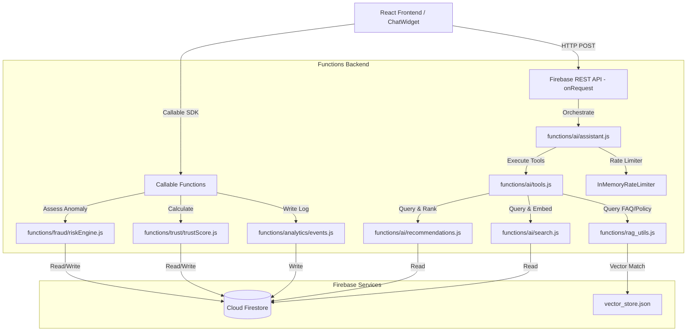

# VENDORA — AI-Powered Marketplace Architecture (Phase 1)

This document provides a technical guide to the Phase 1 architectural upgrade. It details the new modular components, data schemas, security rules, and integration structures preparing Vendora for upcoming AI features.

---

## 1. System Architecture Overview

---

## 2. Event Analytics Foundation

We establish a standardized event model logs under:
- `user_events/{eventId}`: User behavior tracking.
- `search_events/{eventId}`: Natural language queries and matching events.

### Validation & Sanitization
All client-supplied events are processed server-side through `functions/analytics/events.js` which:
1. Validates that `eventType` matches recognized identifiers.
2. Sanitizes input parameters, stripping any sensitive security fields (passwords, tokens, payment credentials).
3. Enforces truncation on metadata strings to prevent injection.

---

## 3. Trust & Fraud Systems

We separate a merchant's evaluation into two distinct scores:

### Trust Score (`functions/trust/trustScore.js`)
Calculates merchant reliability on a scale of `0-100` (mapped to `low`, `medium`, `high`, `excellent` levels) using factors such as:
* Order fulfillment rate
* Order cancellation rate
* Customer review ratings
* Verification status
* Account age (merchant duration)

Calculated scores are stored in `trust_scores/{vendorId}` with historic snapshots in `trust_score_history`.

### Risk Score (`functions/fraud/riskEngine.js`)
Calculates real-time risk profile based on flagged activity flags:
* `HIGH_ORDER_VELOCITY`: >10 orders in 1 hour.
* `HIGH_CANCELLATION_RATE`: >50% cancellation rate.
* `ABNORMAL_TRANSACTION_VALUE`: Single transaction amount exceeding 100,000 PKR.
* `SUDDEN_VELOCITY_SPIKE`: Sudden order velocity surge compared to past averages.
* `SUSPICIOUS_LOGIN_PATTERN`: Multiple logins using different IPs or devices within 10 minutes.

Risk levels map to `LOW` (0-29), `MEDIUM` (30-59), `HIGH` (60-79), and `CRITICAL` (80-100). If high or critical levels trigger, a record is added to `fraud_events` for manual administrative oversight.

---

## 4. Central AI Service Layer

We modularize functions codebase into clean, localized services under `functions/ai/`:

- **`embeddings.js`**: Core module handles OpenRouter embeddings calling and cosine similarity vectors calculation.
- **`prompts.js`**: Stores system prompt instruction templates.
- **`tools.js`**: Defines the JSON schema for tools and coordinates executions.
- **`search.js`**: Implements natural language processing, script-based language identification (English, Urdu, Sindhi), filters extraction, and product document relevance ranking.
- **`recommendations.js`**: Replaces raw Firestore fetches with scoring recommendation results based on user events, ratings, popularity, vendor trust, and risk penalizations.
- **`assistant.js`**: Integrates rate limit checks, handles token verification, coordinates the multi-turn conversational loop, sanitizes output hyperlinks, and maps logs to `ai_conversations`.

---

## 5. Security & Isolation

### Firestore Rules
Strict read/write limitations are enforced on the new collections:
* **Admin-Only**: `risk_scores`, `risk_score_history`, `fraud_events`, `security_events`.
* **Vendor-Only**: Can read own `trust_scores` and `category_requests`.
* **User-Only**: Can read own `user_events` and `ai_conversations`.
* **Public**: Can read support contact details under `admin_settings/contact`.

All modifications to trust, risk, events, and settings must be executed server-side via the Firebase Admin SDK.

### Storage Rules
Differentiates path access to support AI image processing:
- Original uploads: `products/{vendorId}/original/*` (Verified vendor write only)
- Enhanced uploads: `products/{vendorId}/enhanced/*` (Verified vendor or Admin write only)
