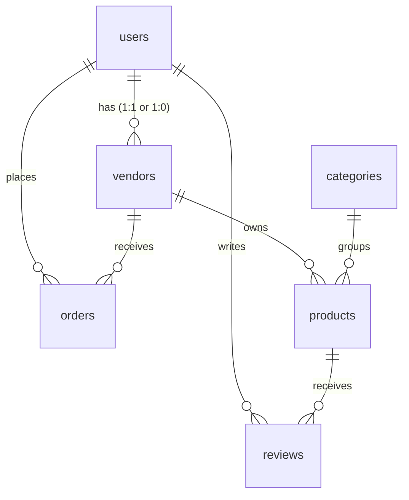

# VENDORA — Firestore Schema & Data Types

This document outlines the Firestore document schemas, collection structures, and TypeScript-style JSDoc definitions for the multi-vendor marketplace database.

---

## 1. Collections Overview



---

## 2. Document Schemas

### `users` (Collection)
Defines platform accounts (Buyers, Vendors, Admins).
- Document ID: `uid` (Matches Firebase Auth user UID)

```typescript
interface UserDoc {
  uid: string;
  name: string;
  email: string;
  role: 'buyer' | 'vendor' | 'admin';
  phone?: string;
  createdAt: timestamp;
}
```

### `vendors` (Collection)
Maintains business credentials for approved and pending sellers.
- Document ID: `vendorId` (Matches User UID)

```typescript
interface VendorDoc {
  vendorId: string;
  businessName: string;
  description: string;
  city: string;
  phone: string;
  nationalIdUrl: string; // Firebase Storage CNIC image path
  verified: boolean;     // Set by Admin
  status: 'pending' | 'approved' | 'rejected';
  rating: number;        // Running average of reviews
  createdAt: timestamp;
}
```

### `products` (Collection)
Product catalog details uploaded by verified merchants.
- Document ID: Auto-generated UUID

```typescript
interface ProductDoc {
  productId: string;
  vendorId: string;      // Ref: vendors.vendorId
  vendorName: string;
  title: string;
  description: string;
  price: number;         // Price in PKR
  category: string;      // Ref: categories.slug
  images: string[];      // Array of Storage URLs
  stock: number;         // Quantity remaining
  variants?: string[];   // e.g. ["Small", "Medium", "Large"]
  createdAt: timestamp;
}
```

### `orders` (Collection)
Platform transactions placed by buyers.
- Document ID: Auto-generated UUID

```typescript
interface OrderDoc {
  orderId: string;
  buyerId: string;       // Ref: users.uid
  vendorId: string;      // Ref: vendors.vendorId
  items: {
    productId: string;
    title: string;
    price: number;
    quantity: number;
    variant?: string;
  }[];
  total: number;         // Total in PKR (excluding shipping/commission)
  shippingCost: number;  // Shipping fee in PKR
  commissionRate: number;// Commission % platform takes (Phase 12)
  status: 'pending' | 'confirmed' | 'shipped' | 'delivered' | 'cancelled' | 'disputed';
  shippingAddress: {
    fullName: string;
    phone: string;
    streetAddress: string;
    city: string;
    postalCode?: string;
  };
  paymentMethod: 'cod' | 'jazzcash' | 'easypaisa';
  createdAt: timestamp;
}
```

### `reviews` (Collection)
Rating feedback written by buyers for products.
- Document ID: Auto-generated UUID

```typescript
interface ReviewDoc {
  reviewId: string;
  productId: string;     // Ref: products.productId
  buyerId: string;       // Ref: users.uid
  buyerName: string;
  rating: number;        // Integer 1-5
  comment: string;
  createdAt: timestamp;
}
```

### `categories` (Collection)
Product groups shown in the sidebar and navigation menus.
- Document ID: `slug` (e.g. `handicrafts`, `fashion`)

```typescript
interface CategoryDoc {
  slug: string;
  name: string;
  iconName: string;      // Match with Lucide Icon name
  createdAt: timestamp;
}
```

---

## 3. New Phase 1 Architecture Collections

### `user_events` & `search_events` (Collection)
Tracks user behavior and search inputs.
- Document ID: `eventId` (Prefixed `evt-`)

```typescript
interface UserEventDoc {
  eventId: string;
  userId: string | null;
  sessionId: string | null;
  eventType: string; // e.g. PRODUCT_VIEW, WISHLIST_ADD, CART_ADD, etc.
  productId: string | null;
  vendorId: string | null;
  category: string | null;
  metadata: object; // Sanitized metadata properties
  createdAt: serverTimestamp;
}
```

### `recommendations` (Collection)
Precalculated or personal recommendations profiles.
- Document ID: `recId` (e.g. `rec-{userId}`)

```typescript
interface RecommendationDoc {
  recId: string;
  userId: string;
  productsList: string[]; // Ref: products.productId array
  updatedAt: timestamp;
}
```

### `category_requests` (Collection)
Requests by merchants to add a new category to VENDORA.
- Document ID: `requestId` (Prefixed `req-`)

```typescript
interface CategoryRequestDoc {
  requestId: string;
  vendorId: string; // Ref: vendors.vendorId
  vendorName: string;
  requestedName: string;
  requestedSlug: string;
  reason: string;
  status: 'pending' | 'approved' | 'rejected';
  createdAt: timestamp;
  reviewedAt?: timestamp;
  reviewedBy?: string; // Ref: users.uid (Admin)
  adminNote?: string;
}
```

### `trust_scores` & `trust_score_history` (Collection)
Calculated reliability scores for merchants.
- Document ID: `vendorId` (Matches User UID)

```typescript
interface TrustScoreDoc {
  vendorId: string;
  score: number; // 0 - 100
  level: 'low' | 'medium' | 'high' | 'excellent';
  factors: {
    totalOrders: number;
    fulfillmentRate: number;
    cancellationRate: number;
    disputeRate: number;
    averageRating: number;
    accountAgeDays: number;
    verified: boolean;
  };
  calculatedAt: serverTimestamp;
}
```

### `risk_scores` & `risk_score_history` (Collection)
Evaluation profiles representing vendor risk signals.
- Document ID: `vendorId` (Matches User UID)

```typescript
interface RiskScoreDoc {
  vendorId: string;
  score: number; // 0 - 100
  level: 'LOW' | 'MEDIUM' | 'HIGH' | 'CRITICAL';
  factors: {
    flags: string[]; // e.g. ["HIGH_ORDER_VELOCITY", "HIGH_CANCELLATION_RATE"]
  };
  status: 'active' | 'archived';
  calculatedAt: serverTimestamp;
}
```

### `fraud_events` (Collection)
Flags raised when critical or high risk levels are detected for vendor accounts.
- Document ID: `eventId` (Prefixed `fe-`)

```typescript
interface FraudEventDoc {
  eventId: string;
  vendorId: string; // Ref: vendors.vendorId
  riskScore: number;
  level: 'HIGH' | 'CRITICAL';
  flags: string[];
  status: 'pending_review' | 'resolved' | 'dismissed';
  createdAt: serverTimestamp;
}
```

### `security_events` & `device_signals` (Collection)
Logs device specifications and security alerts.
- Document ID: Auto-generated UUID or Prefixed ID

```typescript
interface SecurityEventDoc {
  eventId: string;
  eventType: 'LOGIN' | 'LOGOUT' | 'FAILED_LOGIN' | 'SECURITY_EVENT';
  userId: string | null;
  vendorId: string | null;
  riskSignal: string;
  timestamp: serverTimestamp;
  metadata: {
    ip?: string;
    deviceId?: string;
    userAgent?: string;
  };
}
```

### `ai_conversations` & `ai_messages` (Collection)
Maintains audit logs of customer interactions with the chatbot widget.

```typescript
interface AIConversationDoc {
  conversationId: string;
  userId: string;
  mode: 'product_discovery' | 'buyer_support';
  createdAt: serverTimestamp;
}

interface AIMessageDoc {
  conversationId: string;
  userId: string;
  messages: {
    role: 'user' | 'assistant';
    content: string;
  }[];
  createdAt: serverTimestamp;
}
```

### `image_enhancement_jobs` (Collection)
Jobs queue to process merchant images through AI enhancement models.

```typescript
interface ImageEnhancementJobDoc {
  jobId: string;
  productId: string;
  vendorId: string;
  originalUrl: string;
  enhancedUrl?: string;
  status: 'pending' | 'processing' | 'completed' | 'failed';
  createdAt: timestamp;
  completedAt?: timestamp;
}
```

### `admin_settings` (Collection)
Global variables and contact endpoints.
- Document ID: `contact` (for settings/contact document)

```typescript
interface AdminSettingsContactDoc {
  adminEmail: string;
  supportEmail: string;
  updatedAt: timestamp;
}
```
